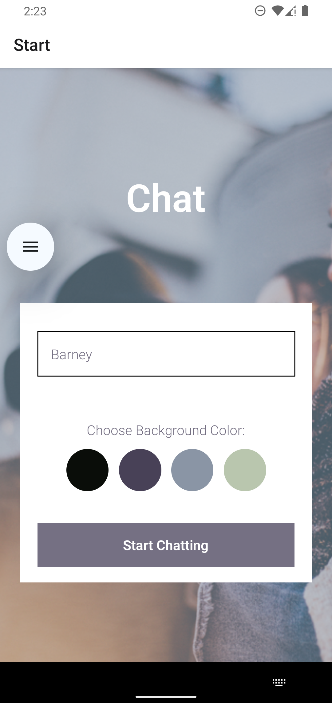
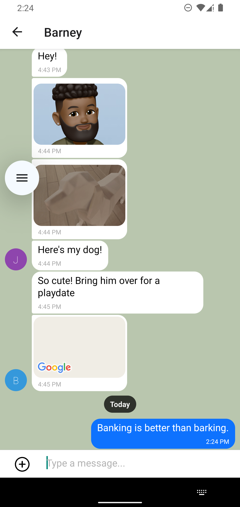
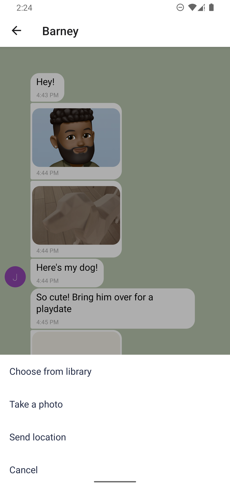
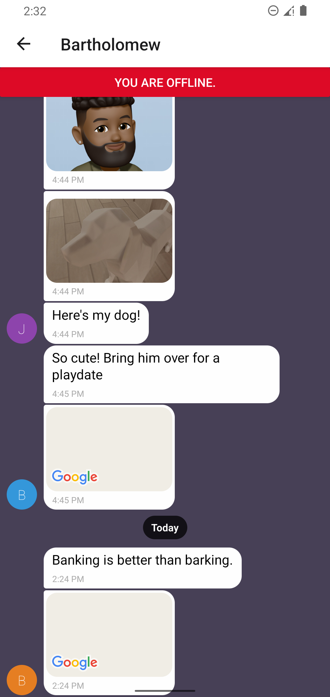

# Chat Application

A chat app for mobile devices using React Native. The app provides users with a chat interface and options to share images and their location.

## Features

-   A page where users can enter their name and choose a background color for the chat screen before joining the chat
-   A page displaying the conversation, as well as an input field and send button
-   Provides two additional communication features: sending images and location data
-   Data gets stored online and offline

## Tools

-   Node.js
-   React Native
-   Expo
-   Firestore
-   Gifted Chat

## Installation

### Install dependencies

```sh
npm install
```

### Create a development build

Follow the instructions [instructions provided](https://docs.expo.dev/develop/development-builds/create-a-build/) by Expo.

### Connect Emulators

Android:

```sh
npx expo run:android
```

~~iOS~~ (under construction) :

```sh
npx expo run:ios
```

_**Note:** Rerun these commands after additional packages are installed._

### Start application

```sh
npx expo start
```

## Environment

### Firebase

Initialize your own Cloud Firestore in `src/firebaseConfig.js` by replacing the following with your app's Firebase project configuration:

```js
const firebaseConfig = {
    apiKey: 'xxxx',
    authDomain: 'xxxx.firebaseapp.com',
    projectId: 'xxxx',
    storageBucket: 'xxxx.firebasestorage.app',
    messagingSenderId: 'xxxx',
    appId: '1:xxxx:web:xxxx',
};
// See: https://support.google.com/firebase/answer/7015592`
```

_**Note:** Consider replacing the values with, for example, `process.env.FIREBASE_API_KEY`, from a `.env` file for better security._

### Google Cloud

In `app.json`, `ios.config.googleMapsApiKey` and `android.config.googleMaps.apiKey` require a Google API key from a `.env` file.

Follow the instructions [instructions provided](https://docs.expo.dev/versions/latest/sdk/map-view/) by Expo.

## Usage

### Start application

```sh
npx expo start
```

### Home Screen

Enter a name and choose a local background color:<br><br>


### Chat Screen

Send messages, images, and location data in chat room:<br><br>



Chat room loads cached messages when offline:<br><br>


## Tasks

-   [ ] Configure ios
-   [ ] Add security with `.env`
